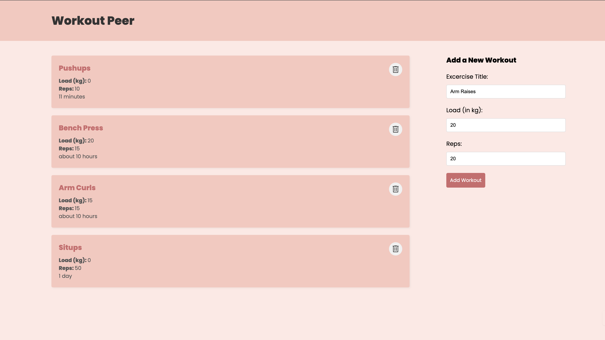

# Workout Peer - MERN Workout Tracker

This is a full-stack web application built using the MERN (MongoDB, Express.js, React.js, Node.js) stack. It allows users to track their workouts by adding and deleting exercises, along with the ability to view workout details such as title, load in kilograms, and number of repetitions.

## Features

- Add new workouts with exercise details
- Delete existing workouts
- View a list of all workouts with exercise details (title, load, reps)
- MongoDB database for data persistence

## Screenshots



## Technologies Used

- **MongoDB**: NoSQL database for storing workout data
- **Express.js**: Web application framework for Node.js
- **React.js**: JavaScript library for building user interfaces
- **Node.js**: JavaScript runtime environment

## Getting Started

### Prerequisites

- Node.js and npm (Node Package Manager) installed on your machine
- MongoDB Atlas account, with a database created

### Installation

1. Clone the repository:
   ```bash
   git clone https://github.com/quicksilver812/workout-peer.git
   ```
3. Navigate to the project directory::
   ```bash
   cd workout-peer
   ```
4. Install the dependencies for the backend::
   ```bash
   cd backend
   npm install
   ```
5. Install the dependencies for the frontend::
   ```bash
   cd ../frontend
   npm install
   ```
6. 5. Create a `.env` file in the `server` directory and add your server port and MongoDB connection string:
   ```bash
   PORT:4000
   MONGO_URI=your_mongodb_connection_string
   ```

### Running the Application

1. Start the server:
   ```bash
   cd backend
   npm run dev
   ```
2. In a separate terminal window, start the client:
   ```bash
   cd frontend
   npm start
   ```
3. The application should now be running at `http://localhost:3000`.

## Contributing

Contributions are welcome! If you find any issues or have suggestions for improvements, please open an issue or submit a pull request.

## License

This project is licensed under the [MIT License](LICENSE).
